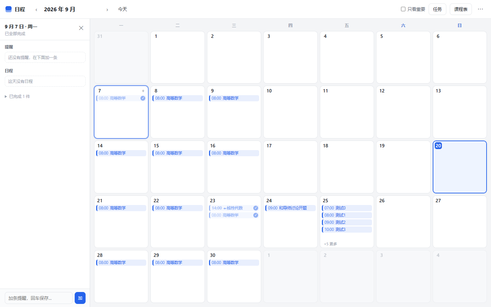
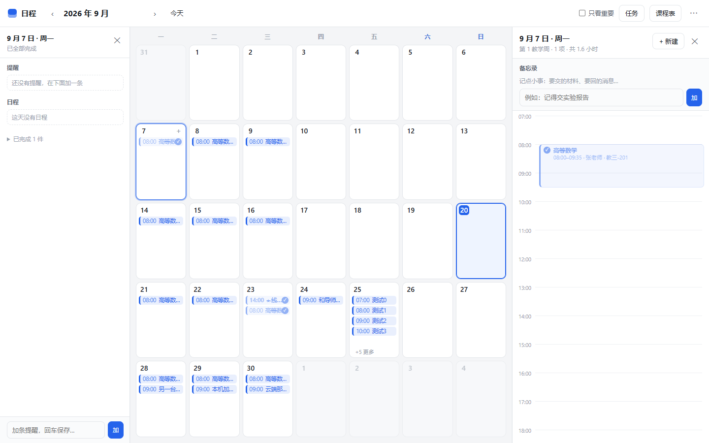
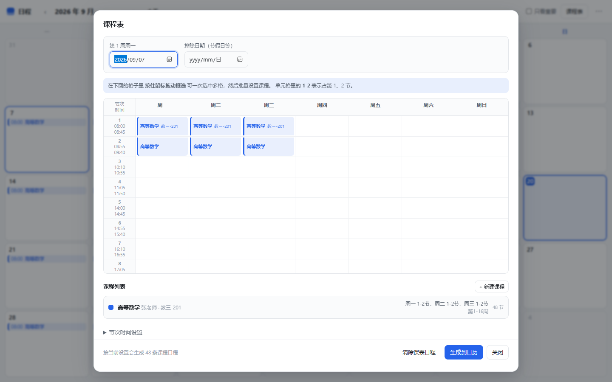
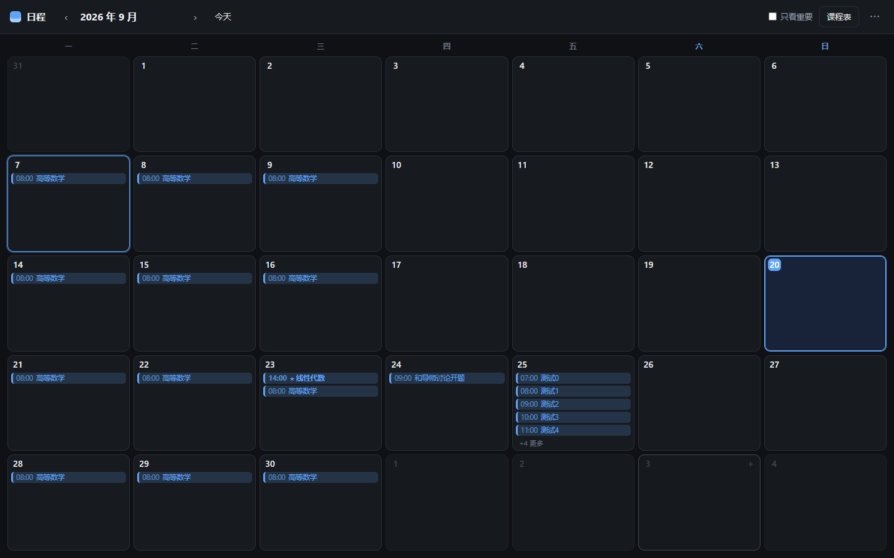

# 日程 · 日历

一个干净的日程管理网页：**大格子月历**一眼看清整月，**双击格子**就能记下当天的事，**点开某天**按小时展开当天时间轴，**左侧任务栏**盯着当天要做的事、做完就勾掉，还有**课程表批量编辑**可以一次性排好整个学期的课。

可以**云同步**：数据存进你自己的一个 GitHub 私有仓库，手机和电脑就通了。

纯静态页面，零运行时依赖，不需要安装、不需要联网。

## 怎么拿到手

**只要一个文件** —— 下载 [`dist/schedule.html`](dist/schedule.html)，双击打开即用。CSS 和 JS 都打包在里面了，可以随便挪位置、拷 U 盘、发微信。

**要完整项目**（想改代码）—— 点仓库右上角 **Code → Download ZIP** 解压，打开 `index.html`。

> ⚠️ 别只下载根目录的 `index.html`：它是个外壳，样式和逻辑在 `css/`、`js/` 里，
> 单拎出来会变成一个没有日历、按钮全点不动的空页面。只想要单文件请用上面的 `dist/schedule.html`。



## 功能

### 月历：大格子，一眼看清

一个月的格子铺满整屏，每格都能直接放下好几条日程——带时间、带颜色。排满的格子会自动收起多余内容，显示 `+N 更多`，不会撑破布局。

标为**重要**的日程前面带 ★，并且永远排在最前面；顶栏的「只看重要」可以一键把其他日程都藏起来，只看要紧的。

### 在日历里直接记

**双击任意格子**，就地弹出输入框，打完标题回车即可——不用开窗口、不用点两次。想细调时间、加地点备注、标颜色，再点开当天面板改。

日程条还能**直接拖到别的日期**上改期。

### 点开某日：以时间为单位

点任意一天，右侧展开当日时间轴，00:00 到 23:00 逐小时排列：

- 日程按真实起止时间定位，一条 90 分钟的课就是 1.5 小时那么高
- 时间重叠的日程自动分列并排，不会互相盖住
- **点轴上任意空白时刻**，就在那个时间新建一条（自动吸附到 15 分钟）
- 今天是哪天，就有一条红线标着此刻
- 打开时自动滚到早上 7 点，如果是今天则滚到当前时刻附近

面板顶部是**备忘录**：给这一天留的小提醒，没有具体时间，只有做没做。



### 左侧任务栏：今天要做什么

点开任意一天，左边一栏就把那天要做的事全列出来——**提醒**（备忘录）和**日程**各一组，没做完的排在上面，做完的收进「已完成 N 件」里折叠起来。

- 底部输入框随手加提醒，回车即存（在别处按 `M` 也能直接跳过来输入）
- **每一条前面都有勾选框，勾一下就划掉**，不用点开任何窗口
- 日程勾掉后只是变灰划线，**不会**因此脱离课程表——之后重新生成课表，那一节仍然是勾着的
- 提醒文字**点一下就能就地改**，回车保存、`Esc` 放弃
- 顶栏「任务」按钮可以收起／展开这一栏

### 勾掉完成的事

除了任务栏，这些地方都能直接勾：

- **月历格子**里的日程条——鼠标移上去，右边浮出一个圈，点一下即可（不会打开编辑窗）
- **当日面板**时间轴上的日程块——左边的圈
- **编辑弹窗**里的「已完成」开关

勾掉只是划掉，数据还在。哪天想反悔，再点一下圆圈就恢复了。

### 课程表：批量排课

这是最省事的部分。点顶栏「课程表」：

1. 填**第 1 周周一**（会自动吸附到你选的那一周的周一，不会填错）
2. **按住鼠标在格子里拖拽框选**，一次选中多天多节（拖出的矩形里每一列都会排上这门课）
3. 选好后从下拉里挑一门课，点「填入」——一次把所有选中的格子都排上

每门课可以单独设置**起止周**（第 1–16 周）、**单双周**、**老师**、**地点**、**颜色**，以及这门课自己额外的停课日期。学期范围的公共假日填在「排除日期」里，所有课一起跳过。

起止周 + 单双周表达不了「第 2 周」「第 7-9 周单周」「第 2 周，再第 5-15 周」这类零碎周次，所以留了一个**指定周次**输入框——填 `2,5-7,9-15,17` 这样的列表即可，填了就以它为准。分隔符逗号、顿号、空格都认，区间可以用 `-`、`~` 或 `至`。

同一格里有好几门课时（比如英语口语和英语阅读共用周一 6-7 节、只是周次不同），格子会上下分开显示，鼠标悬停能看到每一门的老师、地点和周次。



点「生成到日历」把课表铺进日历。生成之后：

- **单独调某一次课**（临时换教室、调课）——改过的那次会被标记保护，以后重新生成**不会**把它覆盖掉
- **单独删某一次课**——重新生成也**不会**把它加回来
- 想全部推倒重来，用「清除课表日程」，手动加的日程不受影响

节次时间是可改的，默认按北航作息共 14 节（上午 1-5、下午 6-10、晚上 11-14，第 1 节 08:00–08:45），在「节次时间设置」里改完即可。

### 云同步：手机和电脑互通

数据存在你自己 GitHub 上的一个**私有仓库**里，不经过任何第三方服务。配一次，之后全自动：

- 打开页面拉一次，改了东西停手约 20 秒推一次
- 页面开着时每 5 分钟看一眼云端，从后台切回前台也会先推后拉
- **断网照常记**，联网了自动补上——localStorage 始终是主存储，同步只是额外一层
- 云端是 git 仓库，**每次同步都是一个提交**，误删误改都能从历史记录里翻回去

两台设备**同时**都改过时，不会偷偷替你选，而是摆出两边的实际情况让你定：
「都保留（推荐）／用云端的／用本机的」。**不管选哪个，被放弃的那一份都会先自动备份到本机**，
不会凭空消失。

配置步骤（建私有仓库、建一个只授权这一个仓库的 token）见 **[docs/sync-setup.md](docs/sync-setup.md)**，
里面有逐步说明和出错对照表。

> 🔒 token 只存在填它的那台设备上，**不会**被写进导出的 JSON，也不会上传。
> 它只有那一个仓库的 Contents 读写权限。

### 手机上

窄屏不是把桌面版压扁，几处交互是分开做的：

- **任务栏和当日面板变成抽屉**，从顶栏下面滑出来，顶栏上的按钮始终点得到
- **顶栏放不下的一律收进 `⋯` 菜单**（「今天」「课程表」），不会有按钮跑到屏幕外
- **靠鼠标悬停才出现的控件全部常显**——格子里的 `+`、提醒行的删除按钮、
  日程块上的勾选圈。触屏没有 hover，靠 hover 才露出来的东西等于不存在
- **点按区域放大**：勾选框 20px、顶栏按钮 36px、日程块上的圈 16px
- **输入框字号提到 16px**：iOS 上小于 16px 的输入框一聚焦就会把整个页面放大
- **月历格子只显示标题**：一格只有约 42px 宽，塞不下「时间 + 标题 + 勾选圈」。
  手机上这一格是看「哪天忙」，标题换行显示能放下四五个字；时间、勾选都在
  点开后的当日面板里（那里点得准）
- **拖拽改期支持触屏**：HTML5 的 drag 在手机上根本不触发，所以改成
  长按约 0.2 秒拎起来、跟着手指走、松手落到哪格就改到哪天（鼠标仍然按住即拖）
- **课程表批量排课改成「点两下」**：点起点、再点终点，圈出一片。
  触摸拖动时浏览器把手势拿去滚动了，框选在手机上只能选中一格
- 适配了刘海和底部小白条，高度用 `100dvh`，地址栏收起/展开不会把内容裁掉

### 其他

- **深色模式**跟随系统，配色自动切换（日程颜色在两种主题下都保证可读）
- **导出 / 导入 JSON**：换电脑、备份、或者手动改数据都行（顶栏 `⋯` 菜单）
- **示例数据**：`⋯` → 「载入示例课程」，一键看看排满课的样子



## 安卓 APK

每次推送到 `main`，GitHub Actions 会自动构建一个 APK 挂到 Release 上，
下载地址固定：

```
https://github.com/avixradioactive-afk/schedule-calendar/releases/download/android-latest/app-debug.apk
```

也可以从仓库右侧的 **Releases** 进去点。手机上打开链接下载、点开安装，
第一次会问你是否允许「安装未知的应用」。

装了 APK 之后，云同步一样能用——**手机这个 App 和电脑浏览器算两台设备**，
在 App 的 `⋯` → 云同步 里填同一个仓库和 token 就通了。

几点说明：

- 这是 **debug 签名**的包，自己装完全没问题，不能上架应用商店。
  要正式签名得再配一个 keystore 放进仓库 Secrets，那是另一件事。
- 安卓工程（`android/`）和网页产物（`www/`）都是 **CI 里现生成的**，
  不进仓库。这样仓库里不用放一百多个生成文件，构建也完全可复现。
- 图标是纯矢量的自适应图标（`tools/android-res/`），各分辨率都清晰，
  仓库里不用放二进制素材。应用名是中文的，由 `tools/android-prepare.js`
  在生成之后覆盖上去。
- minSdk 24（Android 7.0）、targetSdk 36。

想在本机构建的话（需要 JDK 21 + Android SDK）：

```bash
npm ci
npm run build            # 生成 www/index.html
npm run android:add      # 生成安卓工程
npm run android:sync     # 把网页资源同步进去
npm run android:prepare  # 补图标和应用名（必须在 sync 之后）
cd android && ./gradlew assembleDebug
# 产物：android/app/build/outputs/apk/debug/app-debug.apk
```

## 快速开始

直接双击 `index.html`（或单文件版 `dist/schedule.html`）即可，不需要装任何东西。

想用本地服务器打开（或者手机上访问）：

```bash
npm run serve      # http://localhost:8080
```

## 快捷键

| 按键 | 作用 |
| --- | --- |
| `←` `→` | 上 / 下个月 |
| `T` | 回到今天 |
| `N` | 新建日程 |
| `M` | 展开任务栏并开始输入提醒 |
| `C` | 打开课程表 |
| `Esc` | 收起当日面板 |

## 数据存在哪

默认存在浏览器的 `localStorage`（键名 `schedule.v1`），不上传任何服务器，断网也能用。
开了云同步之后，另外存一份到你自己 GitHub 的私有仓库里。

⚠️ 不开同步的话，数据是**跟浏览器绑定的**：换浏览器、换电脑、清理浏览器数据都会丢。
重要的话请定期用 `⋯` → 「导出数据」存一份 JSON。

导出的 JSON 结构很简单，手改也不难：

```jsonc
{
  "version": 2,
  "events": [
    { "id": "…", "date": "2026-09-23", "start": "14:00", "end": "15:00",
      "title": "线性代数", "note": "教三-201", "color": "violet",
      "important": true, "done": false }
  ],
  "memos": [
    { "id": "…", "date": "2026-09-23", "text": "记得交实验报告",
      "done": false, "createdAt": 1790057938637 }          // 只用于排序
  ],
  "courses": [
    { "id": "…", "name": "高等数学", "teacher": "张老师", "location": "教三-201",
      "color": "blue", "fromWeek": 1, "toWeek": 16, "parity": "all",
      "weeks": [],                                        // 非空则忽略上面三项
      "slots": [{ "weekday": 1, "from": 1, "to": 2 }] }   // 周一第 1-2 节
  ],
  "periods": [{ "start": "08:00", "end": "08:45" }],       // 节次时间表
  "settings": { "termStart": "2026-09-07", "excludeDates": ["2026-10-01"] },

  // 下面三个是云同步认「这份数据是谁、什么时候写的」用的，手改时不用管
  "savedAt": 1790057938637,                                // 只用来显示「3 小时前」
  "lastWriter": "…", "lastSeq": "…"
}
```

`memos` 是每天的小提醒（没有时间），`done` 是勾没勾掉。两者都缺省不影响——老数据导入进来会自动补上。

> 同步的判据是文件的 blob sha，**不是时间戳**。两台设备的时钟本来就不可信，
> 拿时间比大小会让时钟慢的那台永远推不上去。
>
> `normalize()` 会**保留不认识的字段**。这条很要紧：以后版本加了新字段，
> 旧客户端拉到新数据时不会把字段抹掉——而手机上装好的 APK 是不会自己更新的，
> 所以「旧客户端」是常态不是例外。

`weekday` 是 1–7（周一至周日），`color` 取 `blue / violet / pink / red / orange / amber / green / teal / slate`。

## 部署到 GitHub Pages

推到 GitHub 后，在仓库 **Settings → Pages** 里把 Source 选成 `main` 分支的 `/ (root)`，等一两分钟就能通过 `https://<用户名>.github.io/<仓库名>/` 访问。

## 开发

应用本身没有依赖；下面这些只用于构建和跑测试。

```bash
npm install
npm run build         # 由源码生成单文件版 dist/schedule.html
npm test              # 数据层 + 同步 + 端到端（源码版与单文件版各跑一遍）
npm run test:store    # 只跑数据层（纯 node，秒出结果）
npm run test:sync     # 只跑同步逻辑（纯 node，用假传输层）
npm run test:ui       # 只跑浏览器测试，截图输出到 test/screenshots/
```

`npm test` 会先校验 `dist/schedule.html` 是否与源码同步——改了源码忘了重新构建会直接报错，避免提交过期的单文件版。

浏览器测试用 `puppeteer-core` 驱动本机已装的 Chrome / Edge，不会下载浏览器。找不到时指定路径：

```bash
CHROME_PATH="/path/to/chrome" npm run test:ui
```

代码结构：

```
index.html            页面骨架（需要配合下面的 css/ js/ 使用）
css/styles.css        全部样式（含深色主题）
js/store.js           数据模型、localStorage、课程展开（可在 node 里单独跑）
js/todo.js            「一条可勾掉的事」的公共渲染与交互（任务栏与备忘录共用）
js/sync.js            云同步逻辑，不碰 DOM（可在 node 里用假传输层单独跑）
js/month.js           月历视图
js/day.js             当日时间轴 + 备忘录
js/tasks.js           左侧任务栏
js/courses.js         课程表批量编辑
js/syncui.js          云同步的设置弹窗、状态显示、冲突选择
js/app.js             装配、弹窗、导入导出、快捷键
tools/build.js        把上面这些内联成单文件 + 安卓用的 www/
tools/android-prepare.js  给安卓工程补图标和中文应用名
tools/android-res/    矢量自适应图标（纯 XML，没有二进制素材）
capacitor.config.json 安卓壳的配置
.github/workflows/    测试 + 构建 APK
dist/schedule.html    ← 自动生成，可直接分发；不要手改
```

`dist/schedule.html` 是构建产物但**会提交进仓库**，这样别人下载单个文件就能用。改完源码记得 `npm run build` 并一起提交。

## 许可

MIT
